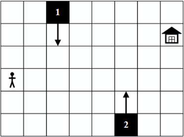
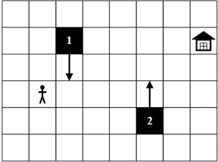
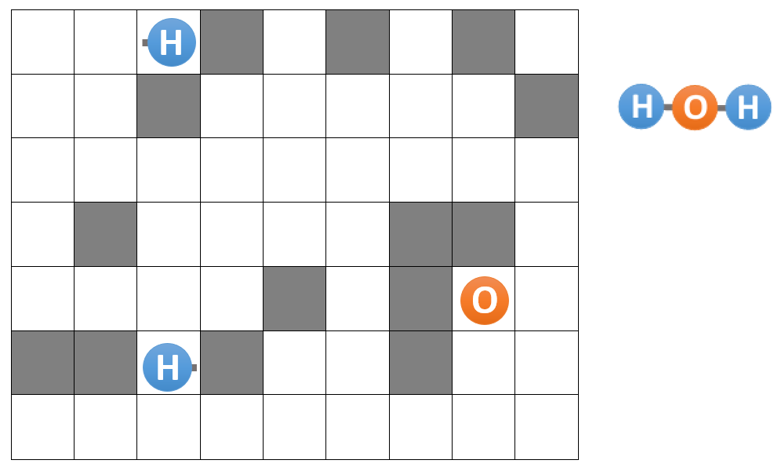
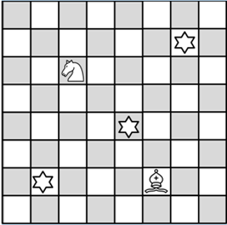
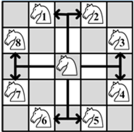

# Аудиториска вежба 3 - Неинформирано пребарување

## Пример - Два сада

Дадени се два сада **J0** и **J1**, со капацитети **C0** и **C1** литри, соодветно. 
Да се доведат до состојба во која **J0** има **G0** литри, а **J1** има **G1** литри.
Акции:
- Испразни кој било од садовите
- Претури течност од еден во друг сад, со тоа што не може да се надмине капацитетот на садот
- Наполни кој било од садовите (за дома)

##### Дефиниција на состојба
Торка (X, Y) која означува дека J0 содржи X литри, а J1 содржи Y литри. Опционална вредност 
'\*', која означува дека е небитно колку литри има во садот.
Цел: Предефинираната состојба до која сакаме да стигнеме. Ако нѐ интересира само едниот сад, 
за другиот можеме да ставиме '\*'.

## Задача 1 - Истражувач

Предложете соодветна репрезентација и напишете ги потребните функции во Python за да се реши следниот проблем за кој една можна почетна состојба е прикажана на сликата

Потребно е човечето безбедно да дојде до куќичката. Човечето може да се придвижува на кое било соседно поле хоризонтално или вертикално. 
Пречките 1 и 2 се подвижни, при што и двете пречки се движат вертикално. Секоја од пречките се придвижува за едно поле во соодветниот правец и насока со секое придвижување на човечето. 

Притоа, пречката 1 на почетокот се движи надолу, додека пречката 2 на почетокот се движи нагоре. Пример за положбата на пречките после едно придвижување на човечето надесно е прикажан на десната слика. 

 

Кога некоја пречка ќе дојде до крајот на таблата при што повеќе не може да се движи во насоката во која се движела, го менува движењето во спротивната насока. 
Доколку човечето и која било од пречките се најдат на исто поле човечето ќе биде уништено.

За сите тест примери изгледот и големината на таблата се исти како на примерот даден на сликите. За сите тест примери почетните положби, правец и насока на движење за препреките се исти. За секој тест пример почетната позиција на човечето се менува, а исто така се менува и позицијата на куќичката.

Во рамки на почетниот код даден за задачата се вчитуваат влезните аргументи за секој тест пример. 

Движењата на човечето потребно е да ги именувате на следниот начин:
- **Right** - за придвижување на човечето за едно поле надесно
- **Left** - за придвижување на човечето за едно поле налево
- **Up** - за придвижување на човечето за едно поле нагоре
- **Down** - за придвижување на човечето за едно поле надолу

Вашиот код треба да има само еден повик на функција за приказ на стандарден излез (print) со кој ќе ја вратите секвенцата на движења која човечето треба да ја направи за да може од својата почетна позиција да стигне до позицијата на куќичката. 

Треба да примените неинформирано пребарување. Врз основа на тест примерите треба самите да определите кое пребарување ќе го користите.

## Задача 2 - Молекула

Предложете соодветна репрезентација и напишете ги потребните функции во Python за да се реши следниот проблем за кој една можна почетна состојба е прикажана на сликата на следниот слајд.

На табла 7x9 поставени се три атоми (внимавајте, двата H-атоми се различни: едниот има линк во десно, а другиот има линк во лево). Полињата обоени во сива боја претставуваат препреки.

Играчот може да ја започне играта со избирање на кој било од трите атоми. Играчот во секој момент произволно избира точно еден од трите атоми и го „турнува“ тој атом во една од четирите насоки: горе, долу, лево или десно.

Движењето на „турнатиот“ атом продолжува во избраната насока се’ додека атомот не „удри“ во препрека или во некој друг атом (атомот секогаш застанува на првото поле што е соседно на препрека или на друг атом во соодветната насока).

Не е возможно ротирање на атомите (линковите на атомите секогаш ќе бидат поставени како што се на почетокот на играта). Исто така, не е дозволено атомите да излегуваат од таблата.

Целта на играта е атомите да се доведат во позиција во која ја формираат „молекулата“ прикажана десно од таблата. Играта завршува во моментот кога трите атоми ќе бидат поставени во бараната позиција, во произволни три соседни полиња од таблата.

Потребно е проблемот да се реши во најмал број на потези.

За сите тест примери изгледот и големината на таблата се исти како на примерот даден на сликата. За сите тест примери положбите на препреките се исти. За секој тест пример се менуваат почетните позиции на сите три атоми, соодветно.
Во рамки на почетниот код даден за задачата се вчитуваат влезните аргументи за секој тест пример. 

Движењата на атомите потребно е да ги именувате на следниот начин:
- **RightX** - за придвижување на атомот X надесно (X може да биде H1, O или H2)
- **LeftX** - за придвижување на атомот X налево (X може да биде H1, O или H2)
- **UpX** - за придвижување на атомот X нагоре (X може да биде H1, O или H2)
- **DownX** - за придвижување на атомот X надолу (X може да биде H1, O или H2)

Вашиот код треба да има само еден повик на функција за приказ на стандарден излез (print) со кој ќе ја вратите секвенцата на движења која треба да се направи за да може атомите од почетната позиција да се доведат до бараната позиција. 

Треба да примените неинформирано пребарување. Врз основа на тест примерите треба самите да определите кое пребарување ќе го користите.

## Задача 3 - Ѕвезди
Предложете соодветна репрезентација и напишете ги потребните функции во Python за да се реши следниот проблем за кој една можна почетна состојба е прикажана на сликата.

На шаховска табла 8x8 поставени се еден коњ, еден ловец и три ѕвезди. Движењето на коњите на шаховската табла е 
во облик на буквата Г: притоа, од дадена позиција можни се 8 позиции до кои даден коњ може да се придвижи, како 
што е прикажано на сликата (1 = горе + горе + лево, 2 = горе + горе + десно, 3 = десно + десно + горе, 
4 = десно + десно + долу, 5 = долу + + долу + десно, 6 = долу + долу + лево, 7 = лево + лево + долу, 
8 = лево + лево + горе)

Движењето на ловците на таблата е по дијагонала. Ловецот прикажан на сликата може да се придвижи на кое било од полињата означени со X. 

Целта на играта е да се соберат сите три ѕвезди. Една ѕвезда се собира доколку некоја од фигурите застане на истото поле каде што се наоѓа и ѕвездата.

Притоа, не е дозволено двете фигури да бидат позиционирани на истото поле и не е дозволено фигурите да излегуваат од таблата. Фигурите меѓусебно не се напаѓаат. 
Движењето на фигурите е произволно, т.е. во кој било момент може да се придвижи која било од двете фигури.
Потребно е проблемот да се реши во најмал број на потези.

За сите тест примери изгледот и големината на таблата се исти како на примерот даден на сликата. За секој тест пример положбите на ѕвездите се различни. Исто така, за секој тест пример се менуваат и почетните позиции на коњот и ловецот, соодветно.
Во рамки на почетниот код даден за задачата се вчитуваат влезните аргументи за секој тест пример. 

Движењата на коњот потребно е да ги именувате на следниот начин:
- **K1** - за придвижување од тип 1 (горе + лево)
- **K2** - за придвижување од тип 2 (горе + десно)
- **K3** - за придвижување од тип 3 (десно + горе)
- **K4** - за придвижување од тип 4 (десно + долу)
- **K5** - за придвижување од тип 5 (долу + десно)
- **K6** - за придвижување од тип 6 (долу + лево)
- **K7** - за придвижување од тип 7 (лево + долу)
- **K8** - за придвижување од тип 8 (лево + горе)

Движењата на ловецот потребно е да ги именувате на следниот начин:
- **B1** - за придвижување од тип 1 (движење за едно поле во насока горе-лево)
- **B2** - за придвижување од тип 2 (движење за едно поле во насока горе-десно)
- **B3** - за придвижување од тип 3 (движење за едно поле во насока долу-лево)
- **B4** - за придвижување од тип 4 (движење за едно поле во насока долу-десно)

Вашиот код треба да има само еден повик на функција за приказ на стандарден излез (print) со кој ќе ја вратите секвенцата на движења која треба да се направи за да може фигурите да ги соберат сите три ѕвезди. 
Треба да примените неинформирано пребарување. Врз основа на тест примерите треба самите да определите кое пребарување ќе го користите.

