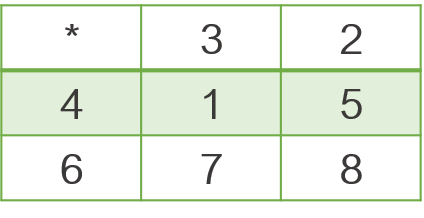
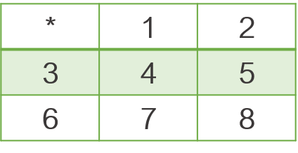
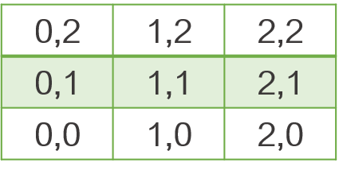
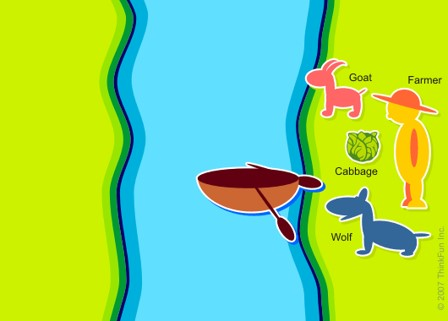

# Аудиториска вежба 4 - Информирано пребарување

## Пример - Сложувалка

Дадена е сложувалка 3x3, на која има полиња со броеви од 1 до 8 и едно празно поле. Празното поле е обележано со ‘*’.

Проблемот е како да се стигне од некоја почетна распределба на полињата до некоја посакувана, на пример:

Акции: акциите ќе ги разгледуваме како придвижување на празното поле, па можни акции се:
- **Горе**
- **Долу**
- **Лево**
- **Десно**

При дефинирањето на акциите, мора да се внимава дали тие воопшто можат да се преземат во дадената сложувалка. 

Состојбата ќе ја дефинираме како стринг кој ќе има 9 знаци (по еден за секое бројче, плус '\*').
Притоа, стрингот ќе се пополнува со изминување на сложувалката од првиот кон третиот ред, од лево кон десно. 
Пример: состојбата за почетната сложувалка е "*32415678", а за финалната сложувалка е "*12345678".

##### Хевристика

1. Број на полиња кои не се на вистинското место

2. Менхетен растојание до целната состојба

За да можеме да го дефинираме растојанието, потребно е да дефинираме координатен систем
Почетокот на координатниот систем е поставен во долниот лев агол на сложувалката
Дефинираме речник за координатите на секое поле од сложувалката. 
Дефинираме функција која пресметува Менхетн растојание за сложувалката. 
Оваа функција на влез прима два цели броеви, кои одговараат на две полиња на кои се наоѓаат броевите за кои треба да пресметаме растојание

## Задача 1 - Истражувач

Предложете соодветна репрезентација и напишете ги потребните функции во Python за да се реши следниот проблем за кој една можна почетна состојба е прикажана на сликата

Потребно е човечето безбедно да дојде до куќичката. Човечето може да се придвижува на кое било соседно поле хоризонтално или вертикално. 
Пречките 1 и 2 се подвижни, при што и двете пречки се движат вертикално. Секоја од пречките се придвижува за едно поле во соодветниот правец и насока со секое придвижување на човечето. 

Притоа, пречката 1 на почетокот се движи надолу, додека пречката 2 на почетокот се движи нагоре. Пример за положбата на пречките после едно придвижување на човечето надесно е прикажан на десната слика. 

 

Кога некоја пречка ќе дојде до крајот на таблата при што повеќе не може да се движи во насоката во која се движела, го менува движењето во спротивната насока. 
Доколку човечето и која било од пречките се најдат на исто поле човечето ќе биде уништено.

За сите тест примери изгледот и големината на таблата се исти како на примерот даден на сликите. За сите тест примери почетните положби, правец и насока на движење за препреките се исти. За секој тест пример почетната позиција на човечето се менува, а исто така се менува и позицијата на куќичката.

Во рамки на почетниот код даден за задачата се вчитуваат влезните аргументи за секој тест пример. 

Движењата на човечето потребно е да ги именувате на следниот начин:
- **Right** - за придвижување на човечето за едно поле надесно
- **Left** - за придвижување на човечето за едно поле налево
- **Up** - за придвижување на човечето за едно поле нагоре
- **Down** - за придвижување на човечето за едно поле надолу

Вашиот код треба да има само еден повик на функција за приказ на стандарден излез (print) со кој ќе ја вратите секвенцата на движења која човечето треба да ја направи за да може од својата почетна позиција да стигне до позицијата на куќичката. 

Треба да примените информирано пребарување. За имплементација на хевристичката функција треба да користите Менхетен растојание.

## Задача 2 - Молекула

Предложете соодветна репрезентација и напишете ги потребните функции во Python за да се реши следниот проблем за кој една можна почетна состојба е прикажана на сликата на следниот слајд.

На табла 7x9 поставени се три атоми (внимавајте, двата H-атоми се различни: едниот има линк во десно, а другиот има линк во лево). Полињата обоени во сива боја претставуваат препреки.

Играчот може да ја започне играта со избирање на кој било од трите атоми. Играчот во секој момент произволно избира точно еден од трите атоми и го „турнува“ тој атом во една од четирите насоки: горе, долу, лево или десно.

Движењето на „турнатиот“ атом продолжува во избраната насока се’ додека атомот не „удри“ во препрека или во некој друг атом (атомот секогаш застанува на првото поле што е соседно на препрека или на друг атом во соодветната насока).

Не е возможно ротирање на атомите (линковите на атомите секогаш ќе бидат поставени како што се на почетокот на играта). Исто така, не е дозволено атомите да излегуваат од таблата.

Целта на играта е атомите да се доведат во позиција во која ја формираат „молекулата“ прикажана десно од таблата. Играта завршува во моментот кога трите атоми ќе бидат поставени во бараната позиција, во произволни три соседни полиња од таблата.

Потребно е проблемот да се реши во најмал број на потези.

За сите тест примери изгледот и големината на таблата се исти како на примерот даден на сликата. За сите тест примери положбите на препреките се исти. За секој тест пример се менуваат почетните позиции на сите три атоми, соодветно.
Во рамки на почетниот код даден за задачата се вчитуваат влезните аргументи за секој тест пример. 

Движењата на атомите потребно е да ги именувате на следниот начин:
- **RightX** - за придвижување на атомот X надесно (X може да биде H1, O или H2)
- **LeftX** - за придвижување на атомот X налево (X може да биде H1, O или H2)
- **UpX** - за придвижување на атомот X нагоре (X може да биде H1, O или H2)
- **DownX** - за придвижување на атомот X надолу (X може да биде H1, O или H2)

Вашиот код треба да има само еден повик на функција за приказ на стандарден излез (print) со кој ќе ја вратите секвенцата на движења која треба да се направи за да може атомите од почетната позиција да се доведат до бараната позиција. 

Треба да примените информирано пребарување. Одредете прифатлива хевристичка функција. 

## Задача 3 - Проблем на фармерот
Предложете соодветна репрезентација и напишете ги потребните функции во Python за да се реши следниот проблем за кој почетната состојба е прикажана на сликата.

Нотребно е да се пренесат зелката, јарето, волкот и фармерот од источната страна на западната страна на реката.
Само фармерот го вози чамецот.
Во чамецот има простор за двајца патници: фармерот и уште еден патник.

Ограничувања: Доколку останат сами (без присуство на фармерот):
- Јарето ја јаде зелката
- Волкот го јаде јарето

Вашиот код треба да има само еден повик на функција за приказ на стандарден излез (print) со кој ќе ја вратите секвенцата од позиции на актерите која одговара на секвенцата на движења со која сите актери ќе бидат пренесени на западната страна на реката. 

Треба да примените информирано пребарување. Дефинирајте соодветна хевристика која ќе биде прифатлива за проблемот.

