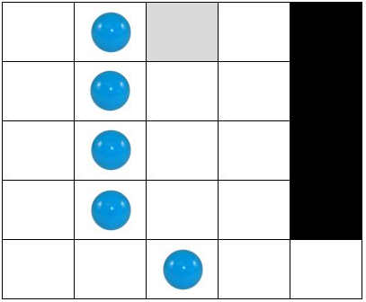
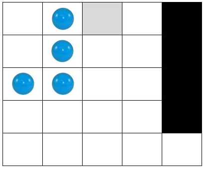
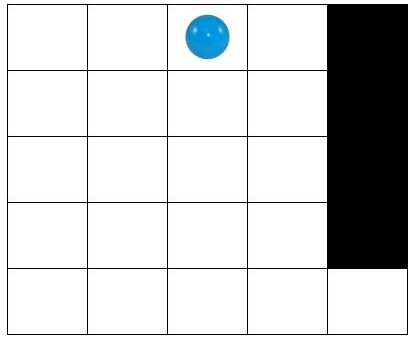
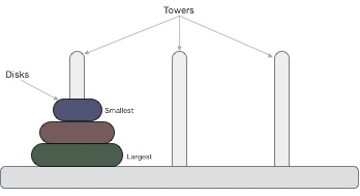
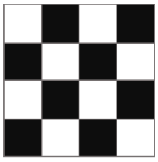
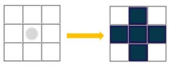

# Аудиториска вежба 5 - Дополнителни примери за пребарување

## Задача 1 - Солитер

Предложете соодветна репрезентација и напишете ги потребните функции во Python за да се реши следниот проблем за кој една можна почетна состојба е прикажана на следната слика

На табла со димензии N x N, каде N > 3 е непарен природен број, поставени се топчиња. Некои од полињата се неупотребливи т.е. во нив никогаш не може да се поставуваат топчиња (на Слика 1 ваквите полиња се обоени со црна боја). Топчињата не се разликуваат помеѓу себе.
Со избор (кликнување) на кое било топче може да се направи преместување на тоа топче од полето во кое се наоѓа -> преку едно поле (во една од шесте насоки: горе-десно, горе-лево, долу-десно, долу-лево, лево или десно), но само ако „прескокнатото“ поле содржи друго топче и полето до „прескокнатото“ поле (во соодветната насока) е слободно. Притоа, „прескокнатото“ топче исчезнува т.е се отстранува од таблата. На пример, со кликнување на топчето кое се наоѓа во петтата редица и третата колона на таблата прикажана на Слика 1, топчето кое се наоѓа во полето горе-лево од него ќе исчезне, а кликнатото топче ќе се позиционира во полето што се наоѓа во третата редица и првата колона (види ја Слика 2!).

Не е дозволено топчињата да излегуваат од таблата. Целта е на таблата да остане точно едно топче кое ќе биде позиционирано во централното поле во првата редица, како што е прикажано на Слика 3. Потребно е проблемот да се реши во најмал број на потези т.е. со избирање (кликнување) на најмал можен број на топчиња.

За сите тест примери обликот на таблата е ист како на примерот даден на Слика 1. За секој тест пример се менува големината N на таблата, како и бројот и распоредот на топчиња и неупотребливи полиња, соодветно.
На влез прво се чита должина и ширина на просторот. Потоа се чита бројот на топчиња. Во наредните линии се читаат позициите на топчињата. На крај се читаат бројот на препреките и во наредна линија позиција на препрека.

Движењата на топчињата (потезите) потребно е да ги именувате на следниот начин:
GoreLevo: (x: x_val, y: y_val) - за преместување во насока горе-лево на топчето кое се наоѓа во x координатата x_val и y координатата y_val (ако таблата ја гледате во стандардниот координатен систем)
GoreDesno: (x: x_val, y: y_val) - за преместување во насока горе-десно на топчето кое се наоѓа во x координатата x_val и y координатата y_val (ако таблата ја гледате во стандардниот координатен систем)
DoluLevo: (x: x_val, y: y_val) - за преместување во насока долу-лево на топчето кое се наоѓа во x координатата x_val и y координатата y_val (ако таблата ја гледате во стандардниот координатен систем)
DoluDesno: (x: x_val, y: y_val) - за преместување во насока долу-десно на топчето кое се наоѓа во x координатата x_val и y координатата y_val (ако таблата ја гледате во стандардниот координатен систем)
Levo: (x: x_val, y: y_val) - за преместување налево на топчето кое се наоѓа во x координатата x_val и y координатата y_val (ако таблата ја гледате во стандардниот координатен систем)
Desno: (x: x_val, y: y_val) - за преместување надесно на топчето кое се наоѓа во x координатата x_val и y координатата y_val (ако таблата ја гледате во стандардниот координатен систем).

Тест пример:
5
3
2,0
1,1
1,3
4
4,1
4,2
4,3
4,4

## Задача 2 - Кулите на Ханој

Во серија се наредени N кружни столбови со иста висина.
На почетокот, на само еден од столбовите наредени се M камени блокови во форма на крофни со различна големина. Блоковите се наредени како кула т.н. најголемиот блок е поставен најдоле на столбот, а секој блок после него е помал од својот претходник подолу.

Крајната цел е кулата од почетниот столб да се премести на некој друг столб т.ш. ќе биде запазен оригиналниот редослед на блоковите.

Ваша задача е преку техниката на неинформирано пребарување низ простор на состојби да одредите кој е најмалиот број на чекори потребни да се пресметат блоковите од почетниот столб до крајниот т.ш. важи правилото дека во секој чекор само еден блок од врвот на некој столб може да се помести на некој друг столб ако е помал од блокот на врвот на другиот столб или другиот столб е празен.
Во почетниот код дадено ви е читањето од стандарден влез на почетната и целната состојба на столбовите, т.ш. секој столб е претставен со посебна торка а броевите ги означуваат големините на блоковите.
На стандарден излез испечатете го минималниот број на потребни чекори да се реши проблемот како и редоследот на потребните акции кои се во форматот MOVE TOP BLOCK FROM PILLAR i TO PILLAR j.

## Задача 3 - Црно бело

Предложете соодветна репрезентација и напишете ги потребните функции во Python за да се реши следниот проблем за кој една можна почетна состојба е прикажана на Слика 1:

Tабла со димензии N x N се состои од бели и црни полиња. Со избор (кликнување) на едно поле се прави промена на бојата на тоа поле и на сите негови непосредни соседи (горе, долу, лево и десно) во спротивната боја, како што е прикажано на Слика 2. Целта е сите полиња на таблата да бидат обоени во црна боја. Потребно е проблемот да се реши во најмал број на потези т.е. со избирање (кликнување) на најмал можен број на полиња.

За сите тест примери обликот на таблата е ист како на примерот даден на Слика 1. За секој тест пример се менува големината N на таблата, како и распоредот на црни и бели полиња на неа, соодветно.

Во рамки на почетниот код даден за задачата се вчитуваат влезните аргументи за секој тест пример. Во променливата n ја имате големината на таблата (бројот на редици односно колони); во променливата fields ја имате бојата на сите полиња на таблата (по редослед: одлево - надесно, редица по редица, ако таблата ја гледате како матрица), каде 1 означува дека полето е обоено во црна, а 0 означува дека полето е обоено во бела боја.

Изборот на полиња (потезите) потребно е да ги именувате на следниот начин:

x: redica, y: kolona

каде redica и kolona се редицата и колоната на избраното (кликнатото) поле (ако таблата ја гледате како матрица).

Вашиот код треба да има само еден повик на функција за приказ на стандарден излез (print) со кој ќе ја вратите секвенцата на потези која треба да се направи за да може сите полиња на таблата да бидат обоени во црна боја. Треба да примените неинформирано пребарување. Врз основа на тест примерите треба самите да определите кое пребарување ќе го користите.
